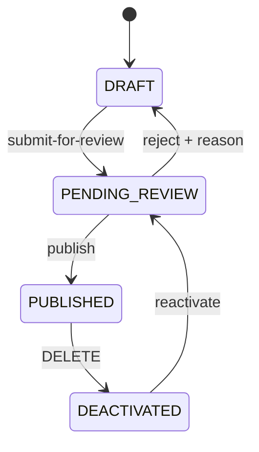

# Редакционный workflow карточек услуг

Обычный посетитель читает только опубликованные карточки. Редакционные действия выполняют
сотрудники с явно назначенными permissions. Это backend API; новый редакционный интерфейс
в эту задачу не входит.

## Что найдено в проекте и какие решения приняты

- Карточка — существующая `OrgFunction` в `org_functions`. Отдельной сущности `Function`
  и отдельной таблицы связок нет. Поле `organizationId` продолжает выполнять привязку.
- До задачи было 39 permissions; добавлены ровно 8 в `Function Management`.
  Старые права сохранены. SUPER_ADMIN получает весь каталог по прежнему механизму;
  ORG_ADMIN/MODERATOR автоматически новых прав не получают.
- Переводы имени/описания — существующие JSONB `name_translations` и
  `description_translations`, формат `{code: {text, source}}`. Переводы интерфейса
  в reference-service не используются для карточек.
- Сохраняется `DELETE /api/functions/{id}` под существующим `FUNCTIONS_DEACTIVATE`.
  Новый permission деактивации не создавался.
- Добавлен `reject` под `FUNCTIONS_REVIEW`: обязательная причина сохраняется в аудите.
- Новые карточки, импорт и восемь сидов создаются как DRAFT — выбран безопасный вариант.
- Для непривязанных черновиков `organizationId` допускает null; видеть/редактировать
  их могут только SUPER_ADMIN или обладатели `FUNCTIONS_MANAGE_ANY_ORGANIZATION`.
  Перед проверкой и публикацией организация обязательна и проверяется через identity-service.
- Изменять содержимое/переводы/требования можно в DRAFT или DEACTIVATED.
  Для PENDING_REVIEW сначала нужен reject; для PUBLISHED — деактивация.
  Это предотвращает изменение опубликованного текста в обход повторной проверки.
- Ранее публичный каталог уже фильтровал `active=true`; утверждение, что он показывал
  абсолютно все записи, не подтвердилось. Теперь все его прежние GET используют строго PUBLISHED.
  Административный список также ограничен организациями пользователя.
- Таблицы аудита/Envers в каталоге не было. Текстовое логирование назначения роли в identity
  не является хранилищем истории услуг. Добавлены `audit_logs` и таблица связей с карточками.
- Автор берётся из подписанного identity JWT: добавлен `userId`, email уже был в subject.
  Email сохраняется снимком, поэтому аудит не теряет автора при переименовании/удалении аккаунта.
  Отдельного существующего клиента отображения авторов в проекте не обнаружено.
  Старую сессию без userId необходимо обновить через refresh/login; мутации без него откатываются.
  Системные сиды имеют автора `system:editorial-seed` и null userId.
- Прецедента импорта не обнаружено; выбран CSV UTF-8 с заголовком.
- Azure `TranslationClient`, `AzureTranslationClient`, `AzureTranslatorProperties`
  восстановлены из истории проекта (95f6f18), а не реализованы вторым клиентом.
  Добавлены тайм-ауты и тестируемое создание HTTP-клиента.

## Переходы и права



| Метод и путь | Permission |
|---|---|
| POST /api/functions/{id}/submit-for-review | FUNCTIONS_SUBMIT_REVIEW |
| GET /api/functions/pending-review | FUNCTIONS_REVIEW |
| POST /api/functions/{id}/reject | FUNCTIONS_REVIEW |
| POST /api/functions/{id}/publish | FUNCTIONS_PUBLISH |
| POST /api/functions/{id}/reactivate | FUNCTIONS_REACTIVATE |
| DELETE /api/functions/{id} | FUNCTIONS_DEACTIVATE (существующий) |
| PUT /api/functions/{id}/translations | FUNCTIONS_EDIT + FUNCTIONS_TRANSLATIONS_EDIT |
| GET /api/functions/{id}/audit | AUDIT_VIEW |
| POST /api/functions/import | FUNCTIONS_IMPORT |
| GET /api/functions/categories и /{id} | Публично |
| POST/PUT/DELETE /api/functions/categories[/{id}] | FUNCTION_CATEGORIES_MANAGE |

Категории размещены под `/api/functions`, поэтому существующий gateway-маршрут подходит
без изменений. Все проверки используют существующий `hasAuthority`.
Глобальный доступ снимает ограничение по организации, но не заменяет permission операции.

Неверный переход — 409; чужая организация — 403; отсутствующая карточка — 404;
ошибка полей — 400. Удаление используемой категории — 409, включая конкурентное назначение
благодаря внешнему ключу. Оптимистическая версия предотвращает потерю параллельных изменений.

Редактор переводов принимает JSON с `nameTranslations` и/или `descriptionTranslations`:
```json
{"nameTranslations":{"en":"Service name","uz":"Xizmat nomi"}}
```
Переданная карта полностью заменяет соответствующее поле и получает `source="human"`.
Непереданное поле сохраняется. Существующий PUT не принимает карты переводов.
Изменение исходного имени/описания по-прежнему удаляет устаревшие машинные переводы,
сохраняя ручные.

## Категории и совместимость

Существующие строковые категории мигрируют в `function_categories`, карточки получают nullable FK.
Ответы сохраняют строку `category` и вычисляемый `active`, дополнительно возвращают
`categoryId` и `status`. Для создания/изменения карточки рекомендуется categoryId;
старое поле category принимает имя существующей категории. Пустая строка category снимает связь.
Создание нового имени категории требует отдельной CRUD-операции с соответствующим правом.

## Импорт

Multipart-поле — `file`, CSV с запятой, UTF-8 (BOM допустим), до 1 MiB и 10 000 записей.
Поддержаны кавычки, экранированные кавычки и переносы строк внутри поля
через [Apache Commons CSV](https://commons.apache.org/proper/commons-csv/apidocs/).

Обязательная колонка по текущей модели — `name`; остальные: `description`, `organizationId`,
`requirements`, `category`, `categoryId`. Для обычного редактора organizationId должен входить
в его организации; пустое значение допускается только при глобальном доступе.

```csv
name,description,organizationId,requirements,categoryId
Пример черновика,Описание для проверки,,Уточнить документы,
```

Ошибки значений одной строки не отменяют остальные; каждая строка сохраняется отдельной транзакцией.
Ответ содержит auditId, imported, failed, functionIds и errors с физическими номерами строк,
считая строку заголовка первой. На весь пакет существует ровно одна запись IMPORT;
история каждой импортированной карточки содержит ссылку на это событие.
Для сотрудника без глобального охвата детали общего импорта скрывают ID/счётчики чужих организаций.
Запись карточки и её включение в событие импорта коммитятся вместе.
При аварийном прекращении процесса событие остаётся с отметкой `Import in progress`.

Неверный заголовок, кодировка или повреждённые кавычки, при которых нельзя надёжно установить
границы записей, дают 400 до записи данных. Повторная отправка файла создаёт новые черновики:
импорт не является обновлением или upsert.

## Восемь сидов и организации

Файл: `function-catalog-service/src/main/resources/seed/editorial-functions.json`.
Уникальный seedKey делает сидирование идемпотентным независимо от наличия старых карточек.

1. Юридическая консультация — не найдена организация юридической помощи.
2. Архивная справка о стаже или зарплате — не найден архив.
3. Дубликат свидетельства о рождении — не найден орган регистрации актов.
4. Справка о наличии или отсутствии судимости — не найден ответственный орган.
5. Справка о налоговой задолженности — не найден налоговый орган.
6. Нотариальное удостоверение доверенности — не найден нотариат.
7. Апостилирование документов — не найден компетентный орган для этой услуги.
8. Государственная регистрация прав на недвижимость — не найден регистрирующий/кадастровый орган.

Проверка текущей БД показала единственную организацию `zafar`, id=1.
Смыслового совпадения нет: все восемь оставлены непривязанными.
Новые организации не создаются. Тексты — материал для редакционной проверки;
конкретные контакты, юридические требования и компетентность организации должны быть уточнены редактором.

Русские тексты сохраняются как исходные и `source="human"`. Для en/uz вызывается существующий
TranslationClient с fromCode=ru; только реально возвращённые значения получают source=machine.
При отсутствии ключа/сбое Azure перевод не имитируется. Пропущенные переводы повторно
запрашиваются при запуске, пока карточка остаётся неизменённым черновиком.
Заполненные ручные переводы и редакторские изменения не перезаписываются.

Настройки вне Git:
- AZURE_TRANSLATOR_ENDPOINT
- AZURE_TRANSLATOR_KEY
- AZURE_TRANSLATOR_REGION

Docker Compose передаёт эти значения из окружения/.env в function-catalog-service.
Отключение сидов: `catalog.seed-editorial.enabled=false`.
Для тестов отдельно отключаются прежние демонстрационные сиды:
`catalog.seed-legacy.enabled=false`.

## Миграция и запуск

V1 Flyway поддерживает как пустую БД, так и существующую схему Hibernate:
baseline version 0, преобразование active=true в PUBLISHED, active=false в DEACTIVATED,
сохранение категорий и JSONB. После преобразования прежние active/category колонки удалены:
данные состояния и категории перенесены в status/FK, строки услуг не удаляются.
Не запускайте старую и новую версии каталога одновременно; откат одного бинарника
без обратного преобразования схемы несовместим с миграцией.

После обновления identity-service и function-catalog-service обновите сессию сотрудников,
чтобы токен содержал новые permissions и userId. Для проверки назначения организации
должны быть доступны identity-service и Eureka. Новые draft-услуги видны сотруднику с
FUNCTIONS_VIEW и глобальным охватом через GET /api/functions/admin.

Пример обычной локальной пересборки сервисов после просмотра изменений:
```sh
docker compose up -d --build --no-deps identity-service function-catalog-service
```
Эта команда не выполнялась в рамках разработки: рабочие контейнеры/БД не мигрировались.
Тесты выполняют миграцию в собственном временном PostgreSQL.

## Проверки

Baseline перед изменениями: `mvn test` по всем пяти модулям — 151 тест, 0 ошибок:
identity 104, reference 24, function-catalog 23; eureka/api-gateway — без тестовых классов.

Полный прогон: `mvn test` из корня. Для PostgreSQL-интеграционных тестов нужен Docker.
Никакие тесты не подключаются к проектному postgres/pgdata: используется Testcontainers.
Совместимость тестового клиента с Docker 29 задаёт
`src/test/resources/docker-java.properties` (`api.version=1.44`);
см. [описание несовместимости в Testcontainers](https://github.com/testcontainers/testcontainers-java/issues/11211).

Проверяются переходы, permissions каждого endpoint, org-scoping, публичный фильтр,
миграция старых данных, категории/FK, конкурентные изменения, откат при невозможности аудита,
частичный CSV-импорт и единственное событие IMPORT, UTF-8, идемпотентность сидов,
Azure-протокол и повторная попытка перевода.


Итоговый проверенный прогон 21.09.2026, завершён в 17:15:32 Asia/Tashkent:
все пять модулей SUCCESS, 207 тестов, 0 failures, 0 errors, 0 skipped.
Из 79 тестов каталога 15 выполняются на PostgreSQL 16.14 через Testcontainers.

| Модуль | Baseline | Итог |
|---|---:|---:|
| eureka-server | 0 | 0 |
| identity-service | 104 | 104 |
| api-gateway | 0 | 0 |
| reference-service | 24 | 24 |
| function-catalog-service | 23 | 79 |
| Всего | 151 | 207 |

docker compose config --quiet и git diff --check прошли.
Реальная генерация en/uz не выполнялась: настройки Azure в доступном .env/окружении отсутствуют.
Проверки вызова Azure и пометки machine выполнены с контролируемыми ответами в тестах.
